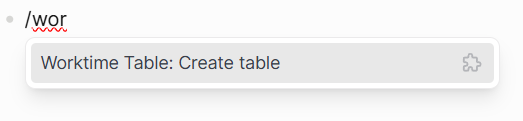

# logseq-worktime-table
A Logseq plugin for creating and editing Markdown-based worktime tables directly in your notes or journal. It helps you record work sessions, calculate total working time, and apply manual offsets such as breaks or corrections.

## Features
* Create worktime tables from the Logseq slash command menu
* Record multiple entries with task, start time, end time, and duration
* Automatically calculate totals across all completed rows
* Add positive or negative offsets for breaks or manual adjustments
* Reopen and edit existing tables from the block context menu
* Optional 12-hour clock display with AM/PM selection
* Export tables as CSV files


## Screenshots / Demo


## Usage
### Create a table

1. Type `/Worktime Table: Create table` in any block
2. Run the command
3. Fill in one or more rows
4. Add offsets if needed
5. Confirm to insert the Markdown table at the current cursor position


### Edit a table

1. Right-click the block dot of the block that contains the table
2. Choose **Worktime Table: Edit table**
3. Update the values in the dialog
4. Confirm to replace the table in place


### Export as CSV

1. Right-click the block dot of the block that contains the table
2. Choose **Worktime Table: Export as CSV**
3. The plugin suggests a filename based on the page name or journal date


## How it works
Each table contains one or more work rows. A row can include:
* a task name
* a start time
* an end time

The plugin calculates:
* the duration of each completed row
* the earliest visible start time
* the summed total duration

By default, the **Total** row shows:
* **Start** = earliest visible start time
* **End** = derived end time calculated as earliest visible start plus total summed duration

If you do not want these values, enable **Hide Start/End in Total row** in the plugin settings so the Total row only shows duration totals.

Only rows with both **Start** and **End** values are included in the calculations.

### Time input
* Enter one or more time ranges
* Add an optional task name for each row
* All valid rows are summed into **Total Duration**
* Both 24-hour and 12-hour input are supported, depending on your settings and entered format


### Offsets
Offsets let you adjust the total duration manually. Common use cases:
* subtract break time
* add credited time
* apply manual corrections

Examples:
* `-0.5` = subtract 30 minutes
* `1.25` = add 1 hour 15 minutes
Positive offsets increase the total duration. Negative offsets reduce it.

## Settings
Open `Logseq → Plugins → logseq-worktime-table → Settings`.

### `use12HourClock`
When enabled:
* the dialog displays times in 12-hour format
* AM/PM selectors are shown

The plugin still accepts:
* 24-hour input such as `14:30`
* 12-hour input such as `2:30 PM`

### `disableTotalRowTimeRange`
When enabled:
* the **Total** row leaves Start and End empty
* only the duration totals are shown

When disabled:
* the **Total** row shows a Start and End value
* **Start** is the earliest visible start time in the table
* **End** is a derived value: earliest start plus total summed duration

### `dialogPrefillJson`
Use this setting to prefill the dialog with your own default rows and offsets.

#### Schema
* `rows`: array of objects in the form `{ "task": string, "start": string, "end": string }`
* `offsets`: array of objects in the form `{ "hours": number, "task": string }`


#### Example
```json
{
  "rows": [
    { "task": "", "start": "", "end": "" },
    { "task": "Meeting", "start": "9:00", "end": "" }
  ],
  "offsets": [
    { "hours": -0.5, "task": "Break" }
  ]
}
```
## Support
If you like this plugin, you can support me here:

<a href="https://www.buymeacoffee.com/wiegi">  </a>